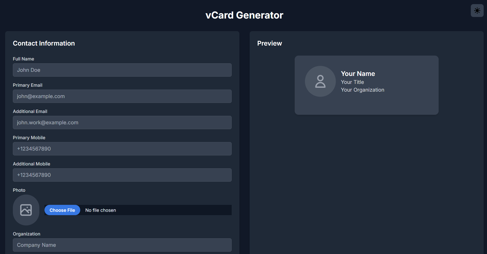

 # Open Source vCard Generator ✨

 A simple, open source and self-hosted vCard (virtual contact card) generator web app that helps users create, preview, and download vCard (`.vcf`) files with contact details and a profile photo. Modern and supports Google Contacts, iOS Contacts and Outlook Contacts. Built with Alpine.js, Tailwind CSS, and a lightweight PHP endpoint for vCard generation.

 [](./LICENSE) [](#)

Table of contents
- Features
- Screenshots
- Quick start
- Usage
- Compatibility
- Security
- Contributing
- License
- Author

## Features 🚀

- Create standards-compliant vCard 3.0 (`.vcf`) files
- Live preview powered by Alpine.js
- Profile photo upload (embedded as base64) so the vCard stays self-contained
- Multiple emails / phone numbers, LinkedIn, website, address, WhatsApp and more
- Dark mode + accessible focus styles (keyboard-first)
- Tiny footprint — single PHP endpoint, no database, no build step

## Screenshots 🖼️

Light mode


Dark mode



> The screenshots above show the in-browser live preview and the form used to build the vCard.

## Quick start (local) 🧭

1. Open a PowerShell terminal in the project folder.
2. Start the built-in PHP web server:

```powershell
php -S localhost:8000
```

3. Open `http://localhost:8000` in your browser.
4. Fill the form and click "Generate vCard" — the browser will download a `.vcf` file.

## Usage 🛠️

- The UI is implemented in `index.html` and the vCard is produced by `generate_vcard.php`.
- Upload a profile photo using the Photo control (max 5 MB by default).
- Fill fields you want included; empty fields are omitted from the generated vCard.

## Compatibility & import targets ✅

- Targets vCard 3.0 and includes line folding + base64-encoded photos for broad importer support.
- Tested with: Google Contacts, iOS Contacts, and Outlook — import experiences may vary slightly for photos between clients.

## Security & deployment notes 🔒

- `generate_vcard.php` includes basic sanitization and checks for file-type and size. Always review server-side code before deploying to public hosts.
- For public deployment consider adding:
    - Rate limiting
    - CSRF protection
    - Authentication if exposing to untrusted users

## Contributing 🤝

Contributions are welcome! The easiest PRs are small and focused. Suggested workflow:

1. Fork the repository
2. Create a feature branch
3. Open a pull request with a clear description

See `CONTRIBUTING.md` for more details.

## License 📄

This project is licensed under the Apache License 2.0 — see the `LICENSE` file for details.

## Author ✍️

Boopathi R — https://www.linkedin.com/in/boopathirb
